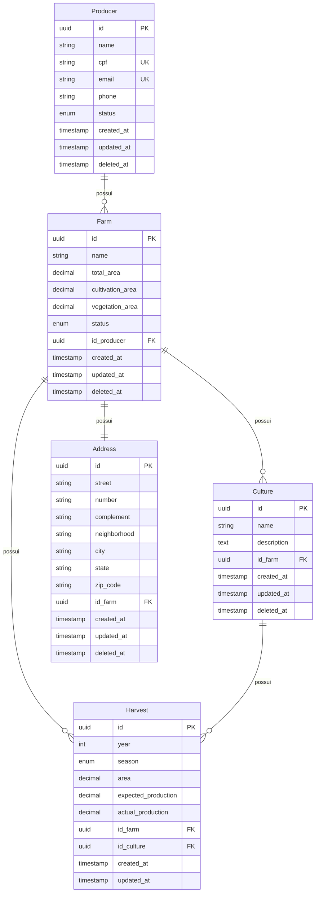

# Brain AG API - Sistema de Gestão Agrícola

## Visão Geral

Este projeto é uma API baseada em NestJS para gerenciamento de produtores agrícolas, fazendas, culturas e colheitas. Fornece um sistema para acompanhamento da produção agrícola, gestão de dados de fazendas e análise de resultados de colheitas.

## Funcionalidades

- Gestão de produtores (operações CRUD)
- Gestão de fazendas com cálculos de área
- Acompanhamento de culturas por fazenda
- Registros de colheitas com métricas de produção
- Análise de produtores e fazendas mais produtivas
- Gestão de endereços das fazendas
- Funcionalidade de exclusão suave (soft delete)
- Paginação e filtros para operações de listagem por query params

## Arquitetura

### Princípios Arquiteturais

O projeto foi desenvolvido como um monolito modular seguindo os princípios SOLID, garantindo um código limpo, testável e de fácil manutenção:

- **Single Responsibility Principle (SRP)**: Cada serviço possui uma única responsabilidade bem definida. Por exemplo:

  - `ListProducerService`: Responsável apenas pela listagem de produtores
  - `CreateProducerService`: Responsável apenas pela criação de produtores
  - `ListTopHarvestService`: Responsável apenas pela listagem das maiores colheitas

- **Open/Closed Principle (OCP)**: O sistema é aberto para extensão, mas fechado para modificação. Isso é alcançado através de:

  - Uso de interfaces para definir contratos
  - Injeção de dependências para permitir extensões
  - Estratégias de validação e filtros extensíveis

- **Liskov Substitution Principle (LSP)**: As implementações concretas são substituíveis por suas interfaces. Por exemplo:

  - `IProducerRepository` pode ser implementado por diferentes tipos de repositórios
  - `IListProducerService` pode ter diferentes implementações mantendo o mesmo contrato

- **Interface Segregation Principle (ISP)**: Interfaces são específicas para cada cliente. Por exemplo:

  - Interfaces de repositório separadas por entidade
  - DTOs específicos para cada operação
  - Serviços com interfaces focadas em suas responsabilidades

- **Dependency Inversion Principle (DIP)**: Módulos de alto nível não dependem de módulos de baixo nível. Ambos dependem de abstrações:
  - Serviços dependem de interfaces de repositório
  - Controladores dependem de interfaces de serviço
  - Uso de injeção de dependência para resolver implementações

### Benefícios da Arquitetura

- **Modularidade**: Cada módulo (producer, harvest) é independente e pode ser desenvolvido, testado e mantido separadamente
- **Testabilidade**: A separação de responsabilidades e uso de interfaces facilita a escrita de testes unitários
- **Manutenibilidade**: Código organizado e coeso facilita a manutenção e evolução do sistema
- **Escalabilidade**: A arquitetura permite adicionar novos módulos sem afetar os existentes
- **Reusabilidade**: Componentes comuns são compartilhados através do diretório `common`

### Estrutura de Diretórios

```
src/
├── common/                   # Código compartilhado entre módulos
│   ├── configs/              # Configurações comuns para aplicação
│   ├── dtos/                 # DTOs compartilhados
│   ├── enums/                # Enums compartilhados
│   ├── filters/              # Filtros de exceção
│   ├── guards/               # Guards de autenticação/autorização
│   ├── repositories/         # Repositório comum para entidades
│   └── utils/                # Formatadores e Validadores comuns
│
├── database/                 # Configuração e entidades do banco de dados
│   ├── entities/             # Entidades do TypeORM
│
├── integrations/             # Integrações com serviços externos
│   └── viacep/               # Integração com API ViaCEP
│
├── modules/                 # Módulos da aplicação
│   ├── producer/            # Módulo de produtores
│   │   ├── controllers/     # Controladores
│   │   ├── dtos/            # DTOs específicos
│   │   ├── providers/       # Exportador de serviços e repositories
│   │   ├── repositories/    # Interfaces de conexão com o banco de dados via ORM
│   │   └── services/        # Serviços
│   │
│   └── harvest/            # Módulo de colheitas
│   │   ├── controllers/     # Controladores
│   │   ├── dtos/            # DTOs específicos
│   │   ├── providers/       # Exportador de serviços e repositories
│   │   ├── repositories/    # Interfaces de conexão com o banco de dados via ORM
│   │   └── services/        # Serviços
│
├── app.module.ts            # Módulo principal da aplicação
└── main.ts                  # Ponto de entrada da aplicação
```

### Descrição dos Diretórios

- **common/**: Contém código compartilhado entre diferentes módulos da aplicação, incluindo decoradores, DTOs, filtros, guards, interfaces, pipes e utilitários.

- **database/**: Responsável pela configuração e gerenciamento do banco de dados, contendo entidades, migrações e implementações dos repositórios.

- **integrations/**: Módulos de integração com serviços externos, como a API ViaCEP para consulta de endereços.

- **modules/**: Módulos principais da aplicação, cada um seguindo a arquitetura em camadas:
  - **producer/**: Módulo responsável pela gestão de produtores
  - **harvest/**: Módulo responsável pela gestão de colheitas

Cada módulo segue uma estrutura interna consistente:

- **controllers/**: Controladores que gerenciam as requisições HTTP
- **dtos/**: Objetos de transferência de dados específicos do módulo
- **providers/**: Objetos para abstração do retorno de services e repositories
- **repositories/**: Objetos responsáveis por abstrair a conexão com banco de dados retirando a responsabilidade do serviço
- **services/**: Lógica de negócio e regras da aplicação

## Modelagem do Banco de Dados



## Relacionamentos entre Entidades

### Produtor

- Relacionamento Um-para-Muitos com Fazenda
- Restrições únicas em CPF e email
- Exclusão lógica habilitada

### Fazenda

- Relacionamento Muitos-para-Um com Produtor
- Relacionamento Um-para-Muitos com Cultura
- Relacionamento Um-para-Muitos com Colheita
- Relacionamento Um-para-Um com Endereço
- Exclusão lógica habilitada

### Cultura

- Relacionamento Muitos-para-Um com Fazenda
- Relacionamento Um-para-Muitos com Colheita
- Exclusão lógica habilitada
- Restrição única de nome por fazenda

### Colheita

- Relacionamento Muitos-para-Um com Fazenda
- Relacionamento Muitos-para-Um com Cultura
- Acompanhamento de ano, estação, área e métricas de produção

### Endereço

- Relacionamento Um-para-Um com Fazenda
- Exclusão lógica habilitada
- Armazena informações completas de endereço

## Stack Tecnológica

- Framework NestJS
- TypeScript
- TypeORM
- Docker & Docker Compose
- PostgreSQL
- Jest para testes
- Swagger para documentação da API

## Endpoints da API

### Endpoints de Integrações Externas

- `GET /address/:cep` - Obter detalhes de um endereço por CEP

### Endpoints de Produtor

- `POST /producer` - Registrar um produtor
- `GET /producer` - Listar produtores com paginação e filtrável
- `GET /producer/top` - Listar os 3 maiores produtores por produção real
- `GET /producer/:id` - Obter detalhes do produtor
- `PATCH /producer/:id` - Atualizar produtor
- `DELETE /producer/:id` - Deletar produtor Logicamente

### Endpoints de Fazenda

- `POST /farm` - Registrar nova propriedade rural
- `GET /farm` - Listar propriedades rurais com paginação e filtrável
- `GET /farm/top` - Obter propriedades rurais mais produtivas com base na produção real, por ano, cultura ou estado

### Endpoints de Cultura

- `POST /culture` - Registrar nova cultura vinculada a uma propriedade rural

### Endpoints de Colheita

- `POST /harvest` - Registrar nova safra em uma propriedade rural vinculada a uma cultura
- `GET /harvest/top` - Listar as 3 maiores safras com base na produção real por ano, cultura ou estado

### Validação de Dados

- Validação de CPF
- Validação de área (cultivada + vegetação ≤ total)
- Validação de formato de email
- Validação de campos obrigatórios
- Aplicação de restrições únicas

### Tratamento de Erros

- Filtros de exceção personalizados
- Pipes de validação
- Tratamento global de erros
- Códigos de status HTTP apropriados
- Mensagens de erro detalhadas

## ScreenShoots

- Documentação dos Endpoints (Swagger)
  

- Cobertura de Testes Unitários
  

## Como Executar o Projeto

### Pré-requisitos

- Node.js (versão 18 ou superior)
- Docker e Docker Compose
- PostgreSQL (se não estiver usando Docker)

### Configuração do Ambiente

1. Clone o repositório:

```bash
git clone https://github.com/victordsantoss/brain-ag-api
cd brain-ag-api
```

2. Instale as dependências:

```bash
npm install
```

3. Configure as variáveis de ambiente:

```bash
cp .env.example .env
```

Edite o arquivo `.env` com suas configurações locais.

### Executando com Docker

1. Inicie os containers:

```bash
docker-compose up
```

### Executando Testes

Execute testes unitários:

```bash
npm run test
```

Visualize a cobertura de testes:

```bash
npm run test:cov
```

### Documentação da API

Após iniciar o servidor, a documentação Swagger estará disponível em:

```
http://localhost:3000/docs
```
